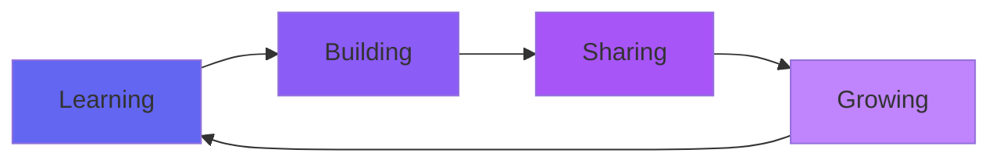

<div align="center">

<!-- Animated Header with Glitch Effect -->


<!-- Animated Typing with Multiple Lines -->
<a href="https://git.io/typing-svg"></a>

<!-- Cool Badge Animations -->
<p>
  
  
  
</p>

</div>

---

<!-- Matrix Rain Effect ASCII -->
```
╔═══════════════════════════════════════════════════════════════════════════╗
║  01001000 01100101 01101100 01101100 01101111  01010111 01101111 01110010  ║
║  ║                                                                     ║    ║
║  ║  🌟 Passionate about creating impactful solutions                  ║    ║
║  ║  🚀 Currently building: Web Photobooth                             ║    ║
║  ║  💡 Always learning, always growing                                ║    ║
║  ║  🎯 Mission: Code with purpose, develop with passion               ║    ║
║                                                                             ║
╚═══════════════════════════════════════════════════════════════════════════╝
```

<div align="center">

## 🎮 PLAY SOME GAMES! 🎮

### 🐍 Snake Game - Watch it eat my contributions!


### 🎯 Contribution Activity Graph
[](https://github.com/FARAZIFTAN)

</div>

---

## 💫 About Me


```javascript
const faraziftan = {
    pronouns: "He" | "Him",
    code: ["JavaScript", "Python", "Java", "SQL"],
    askMeAbout: ["Web Dev", "Data Science", "AI/ML", "Tech"],
    technologies: {
        frontEnd: {
            js: ["React", "Redux", "Next.js"],
            css: ["Tailwind", "Bootstrap", "Material-UI"]
        },
        backEnd: {
            js: ["Node.js", "Express"],
            python: ["Django", "Flask", "FastAPI"]
        },
        dataScience: ["Pandas", "NumPy", "Scikit-learn", "TensorFlow"],
        databases: ["MongoDB", "MySQL", "PostgreSQL"],
        devOps: ["Docker", "Git", "GitHub Actions"],
        tools: ["VS Code", "Jupyter", "Postman"]
    },
    currentProject: "Web Photobooth 📸",
    funFact: "I debug with console.log() and I'm proud of it! 😄"
};
```

<details>
<summary>📊 More About My Coding Journey</summary>
<br>

- 🔭 Currently working on **Web Photobooth** - Making memories digital!
- 🌱 Learning **Advanced AI/ML** and **Cloud Architecture**
- 👯 Looking to collaborate on **Open Source Projects**
- 💬 Ask me about **Full-stack Development, Data Science, or Tech in general**
- ⚡ Fun fact: **I think debugging is like being a detective in a crime movie where you're also the murderer** 🕵️

</details>

---

## 🛠️ Tech Arsenal

<div align="center">

### 👨‍💻 Languages
<p>
  
</p>

### 🎨 Frontend Development
<p>
  
</p>

### ⚙️ Backend Development
<p>
  
</p>

### 📊 Data Science & AI
<p>
  
  
  
  
  
</p>

### 🔧 Tools & Technologies
<p>
  
</p>

</div>

---

## 📈 GitHub Analytics

<div align="center">
  
  
</div>

<div align="center">
  
  
</div>

<!-- Trophies -->
<div align="center">
  
</div>

---

## 🌟 Featured Projects

<div align="center">

<a href="https://github.com/FARAZIFTAN/web-photobooth">
  
</a>

</div>

### 📸 Web Photobooth
> 🎯 An interactive web application for capturing memorable moments with real-time effects

**✨ Key Features:**
- 📷 Real-time photo capture and preview
- 🎨 Multiple filters and effects
- 💾 Easy download and sharing
- 🚀 Built with modern web technologies

**🛠️ Tech Stack:** React • Node.js • Express • MongoDB

---

## 🎯 Current Focus



<div align="center">

| 🎯 Goal | 📊 Progress | 🎉 Status |
|---------|-------------|-----------|
| Master React Advanced Patterns | ████████░░ 80% | 🔥 In Progress |
| Build 10 Full-stack Projects | ██████░░░░ 60% | 💪 Working On It |
| Contribute to Open Source | ████░░░░░░ 40% | 🌱 Growing |
| Learn Cloud Architecture | ███░░░░░░░ 30% | 🚀 Starting |

</div>

---

## 📊 Weekly Development Breakdown

<!--START_SECTION:waka-->
```text
JavaScript   12 hrs 30 mins  ███████████░░░░░░░░░░  45.2%
Python       8 hrs 15 mins   ███████░░░░░░░░░░░░░░  29.8%
React        4 hrs 20 mins   ████░░░░░░░░░░░░░░░░░  15.7%
CSS          1 hr 45 mins    █░░░░░░░░░░░░░░░░░░░░   6.3%
Other        50 mins         ░░░░░░░░░░░░░░░░░░░░░   3.0%
```
<!--END_SECTION:waka-->

---

## 🌐 Connect With Me

<div align="center">

[](https://linkedin.com/in/FARAZIFTAN)
[](https://github.com/FARAZIFTAN)
[](mailto:your.email@example.com)
[](https://your-portfolio.com)
[](https://twitter.com/FARAZIFTAN)
[](https://instagram.com/FARAZIFTAN)

</div>

---

## 💭 Random Dev Quote

<div align="center">


</div>

---

## 🎵 Coding Vibes

<div align="center">

[](https://open.spotify.com/user/FARAZIFTAN)

</div>

---

<div align="center">

### 💖 Support My Work

If you like what I do, consider buying me a coffee! ☕

[](https://buymeacoffee.com/faraziftan)

---

### 📫 Let's Build Something Amazing Together!


**Made with 💜 and lots of ☕ by A.M. Faraziftan**


</div>
