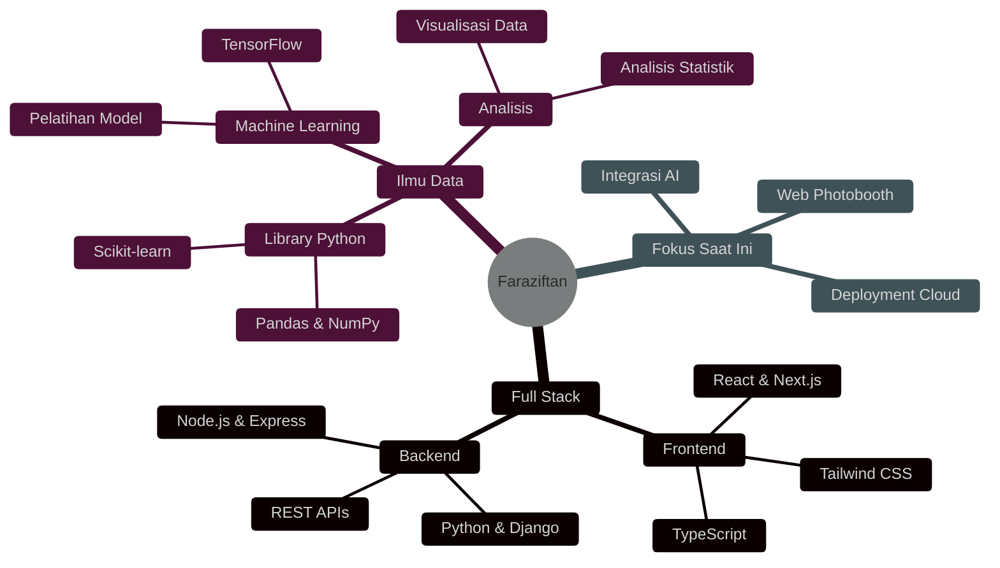

<div align="center">

<!-- Ultra Premium Animated Header -->


<!-- Epic Typing Animation -->
<a href="https://git.io/typing-svg">
  
</a>

<!-- Premium Status Badges -->
<p align="center">
  
  
  
  <br/>
  
  
</p>

</div>

---

<!-- Glowing Divider -->


##  Tentang Saya


<div align="left">

```typescript
interface Pengembang {
  nama: string;
  peran: string[];
  lokasi: string;
  bahasa: string[];
  motto: string;
}

const faraziftan: Pengembang = {
  nama: "A.M. Faraziftan",
  peran: ["Pengembang Full-stack", "Ilmuwan Data", "Pemecah Masalah"],
  lokasi: "Bandung, Indonesia 🇮🇩",
  bahasa: ["JavaScript", "TypeScript", "Python", "Java"],
  motto: "Bismillah - Coding dengan tujuan, develop dengan passion ✨"
};

// Sedang mengerjakan
const projekSaatIni = {
  nama: "Web Photobooth 📸",
  status: "Dalam Pengembangan",
  deskripsi: "Membuat kenangan menjadi digital, satu klik pada satu waktu"
};
```

</div>

<br clear="right"/>

### 🎯 Apa Yang Saya Kerjakan

<table>
  <tr>
    <td align="center" width="33%">
      
      <br><b>Pengembangan Full-stack</b>
      <br><sub>Membangun aplikasi web yang scalable</sub>
    </td>
    <td align="center" width="33%">
      
      <br><b>Ilmu Data & AI</b>
      <br><sub>Mengekstrak insight dari data</sub>
    </td>
    <td align="center" width="33%">
      
      <br><b>Pemecahan Masalah</b>
      <br><sub>Mengubah tantangan jadi solusi</sub>
    </td>
  </tr>
</table>

---


##  Teknologi yang Dikuasai

<div align="center">

### 🎨 Frontend

<p align="center">
  
</p>

### ⚡ Backend

<p align="center">
  
</p>

### 🧠 Ilmu Data & AI

<p align="center">
  
  
  
  
  
</p>

### 🛠️ Tools & Teknologi

<p align="center">
  
</p>

</div>

---


##  Statistik GitHub

<div align="center">
  
 


</div>

<div align="center">
  


</div>

<!-- Trophy Section -->
<div align="center">
  
</div>

---


##  Proyek Unggulan

<div align="center">

<a href="https://github.com/FARAZIFTAN/web-photobooth">
  
</a>

</div>

<table align="center">
  <tr>
    <td align="center" width="50%">
      <h3>📸 Web Photobooth</h3>
      <p><i>Aplikasi web interaktif untuk mengabadikan momen berkesan</i></p>
      <p>
        
        
        
      </p>
      <p>✨ Filter real-time | 📷 Capture HD | 🎨 Efek kustom</p>
    </td>
    <td align="center" width="50%">
      <h3>🚀 Segera Hadir!</h3>
      <p><i>Sedang membangun proyek keren...</i></p>
      
      <p><b>Nantikan proyek-proyek menarik lainnya!</b></p>
    </td>
  </tr>
</table>

---


## 📊 Aktivitas Coding

<div align="center">

<!--START_SECTION:waka-->

```text
💻 Yang Sedang Dikerjakan Minggu Ini

JavaScript       ████████████░░░░░░░░  45.2%  ⚡ Membangun Web Photobooth
Python          ████████░░░░░░░░░░░░  29.8%  🧠 Proyek Analisis Data
React           ████░░░░░░░░░░░░░░░░  15.7%  🎨 Pengembangan UI/UX
CSS/Tailwind    ██░░░░░░░░░░░░░░░░░░   6.3%  💅 Styling & Desain
Lainnya         █░░░░░░░░░░░░░░░░░░░   3.0%  📚 Belajar & Riset
```

<!--END_SECTION:waka-->

</div>

---


## 🎯 Target & Fokus Saat Ini

<div align="center">

| 🎯 Target | 📊 Progress | 💡 Status |
|:--------|:----------:|:----------|
| 🚀 Kuasai Pola React Lanjutan |  | 🔥 Hampir Selesai! |
| 💼 Bangun 10 Proyek Production |  | 💪 Sedang Berlangsung |
| 🌟 Kontribusi Open Source |  | 🌱 Berkembang |
| ☁️ Belajar Arsitektur Cloud |  | 🚀 Memulai |

</div>

<div align="center">



</div>

---


## 💬 Quote Developer Random

<div align="center">


</div>

---


## 🌐 Hubungi Saya

<div align="center">

<a href="https://linkedin.com/in/FARAZIFTAN" target="_blank">
  
</a>
<a href="mailto:your.email@example.com">
  
</a>
<a href="https://github.com/FARAZIFTAN" target="_blank">
  
</a>
<a href="https://twitter.com/FARAZIFTAN" target="_blank">
  
</a>
<a href="https://instagram.com/FARAZIFTAN" target="_blank">
  
</a>
<a href="https://your-portfolio.com" target="_blank">
  
</a>

<br/><br/>

### 💖 Dukung Karya Saya

<a href="https://buymeacoffee.com/faraziftan" target="_blank">
  
</a>

</div>

---

<div align="center">


###  Dibuat dengan 💜 dan banyak ☕ oleh A.M. Faraziftan


**"Bismillah - Memulai setiap proyek dengan tujuan dan passion"** ✨


</div>
